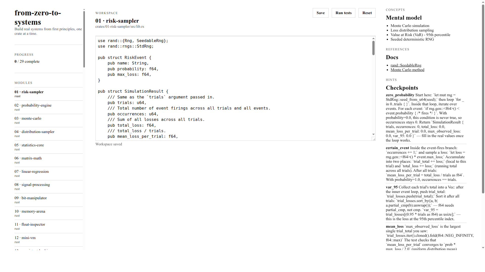

<h3 align="center">from-zero-to-systems</h3>

<p align="center">
  Learn Rust by building 29 real applications, from probability engines to distributed consensus.<br>
  No toy exercises. Every crate is a working system with a genuine use case.
</p>

---

<p align="center">
  
</p>

## What it does

29 numbered crates, each independently runnable, each a real application. Later crates import earlier ones as dependencies, so the complexity builds naturally. A TUI game runner and a browser-based workspace track your progress.

```
cargo run -p play
```

```
  from-zero-to-systems                                          01 / 29
─────────────────────────────────────────────────────────────────────────
  01  02  03  04  05  06  07  08  09  10  11  12  13  14  ...
  .   .   .   .   .   .   .   .   .   .   .   .   .   .   ...
─────────────────────────────────────────────────────────────────────────
  01 . risk-sampler                       | info
                                          |
  press r to run tests                    | Simulate risk events across
                                          | thousands of trials to
                                          | calculate Value at Risk.
                                          |
                                          | Completed  0 / 29
─────────────────────────────────────────────────────────────────────────
  r run  .  h hint  .  d docs  .  c concepts  .  <- -> navigate  .  q quit
```

## Who this is for

Developers coming from Python, Go, TypeScript, or another language who already understand programming fundamentals and want to learn Rust by building real things.

## How it works

1. Clear the implementation in `crates/01-risk-sampler/src/lib.rs`. Leave the tests untouched.
2. Read the first test. It tells you exactly what to build:

```rust
#[test]
fn zero_probability_event_never_occurs() {
    let events = vec![RiskEvent {
        name: "never".into(),
        probability: 0.0,
        max_loss: 1_000_000.0,
    }];
    let result = simulate(&events, 10_000, 42);
    assert_eq!(result.occurrences, 0);
    assert_eq!(result.total_loss, 0.0);
}
```

3. Write the minimum to make it pass. Press `r` in the runner. Watch it go green.
4. Move to the next crate. Later crates import earlier ones.

## Web UI

```
cargo install --path play --bin fzts --force
fzts
```

Opens `http://127.0.0.1:7878/web/index.html` with a three-column workspace. Challenge 01 ships in Rust, C, Python, and Haskell.



## Tiers

| Tier | Crates | Domain |
|------|--------|--------|
| 1 | 01 to 05 | Probability and Statistics |
| 2 | 06 to 08 | Linear Algebra |
| 3 | 09 to 12 | Low-Level Systems |
| 4 | 13 to 17 | Storage Internals |
| 5 | 18 to 23 | Distributed Systems |
| 6 | 24 to 29 | AI and Machine Learning |

## How it compares

Most learn-Rust resources are either reference documentation (the Rust Book), collections of small exercises (Rustlings, Exercism), or single large projects (Writing an OS in Rust). from-zero-to-systems is a graded sequence of 29 real applications that build on each other.

**Where this is stronger.** Each crate has a genuine use case. The dependency graph means you learn ownership, lifetimes, and traits in context rather than isolation. The game runner gives immediate feedback. Six domains (probability, linear algebra, systems, storage, distributed, AI) cover more ground than any single-project course.

**Where this is weaker.** It does not teach async Rust, web frameworks, or GUI development. It is not a reference. If you want to look up how iterators work, read the Rust Book. If you want to build 29 things and understand why Rust makes the choices it does, start here.

## Dependency graph

```
01-risk-sampler ──────────────────────────────────────────────── standalone
02-probability-engine ──── depends on ──► 01
03-monte-carlo ─────────── depends on ──► 02
04-distribution-sampler ── depends on ──► 02
05-statistics-core ─────── depends on ──► 03
06-matrix-math ────────────────────────────────────────────────── standalone
07-linear-regression ───── depends on ──► 05, 06
08-signal-processing ───────────────────────────────────────────── standalone
09-bit-manipulator ────────────────────────────────────────────── standalone
10-memory-arena ───────────────────────────────────────────────── standalone
11-float-inspector ─────────────────────────────────────────────── standalone
12-mini-vm ─────────────── depends on ──► 09, 10
13-slotted-page ────────────────────────── standalone
14-b-tree ──────────────── depends on ──► 13
15-buffer-pool ─────────── depends on ──► 13
16-sstable ─────────────────────────────── standalone
17-skip-list ───────────────────────────── standalone
18-consistent-hashing ─────────────────────────────────────────── standalone
19-bloom-filter ───────────────────────────────────────────────── standalone
20-rate-limiter ───────────────────────────────────────────────── standalone
21-merkle-tree ─────────── depends on ──► 19
22-gossip-protocol ─────── depends on ──► 20
23-raft-consensus ──────── depends on ──► 22
24-gradient-descent ────── depends on ──► 06
25-neural-net ──────────── depends on ──► 06, 24
26-decision-tree ───────── depends on ──► 05, 25
27-k-means ─────────────── depends on ──► 05, 06
28-attention-mechanism ─── depends on ──► 06, 24
29-bpe-tokeniser ───────── depends on ──► 09
```

## Licence

Dual-licensed under [MIT](LICENSE-MIT) and [Apache 2.0](LICENSE-APACHE).
