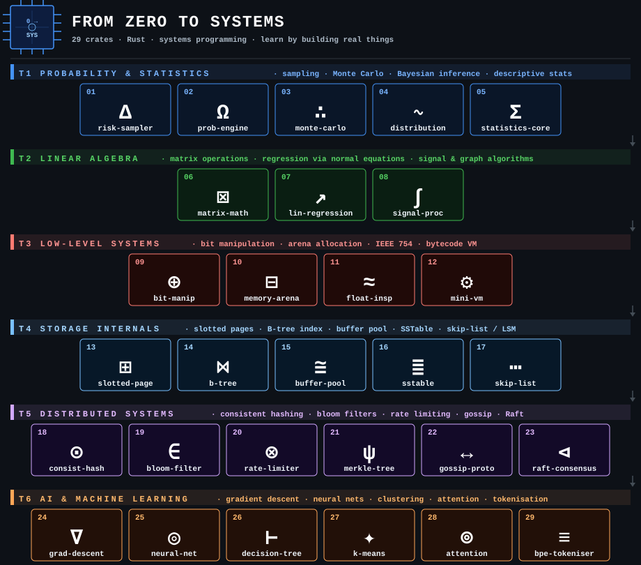

# from-zero-to-systems



> Build increasingly complex Rust applications, from probability engines to distributed consensus, grounded in real-world use cases across finance, science, infrastructure, AI, and security.

## Who this is for

Developers coming from Python, Go, TypeScript, or another language who already understand programming fundamentals and want to learn Rust by building real things. No toy exercises. Every crate is a working application with a genuine use case.

## How it works

Each numbered crate under `crates/` is:

- **Independently runnable:** `cargo run -p <crate-name>`
- **A reusable library:** later crates import earlier ones as dependencies
- **Self-documenting:** each README has an ELI5, an educated-generalist explanation, real-world "used in the wild" callouts, and Rust concepts covered

## Dependency Graph

```
01-risk-sampler ──────────────────────────────────────────────── standalone
02-probability-engine ──── depends on ──► 01
03-monte-carlo ─────────── depends on ──► 02
04-distribution-sampler ── depends on ──► 02
05-statistics-core ─────── depends on ──► 03
06-matrix-math ────────────────────────────────────────────────── standalone
07-linear-regression ───── depends on ──► 05, 06
08-graph ───────────────────────────────── standalone
09-bit-manipulator ────────────────────────────────────────────── standalone
10-memory-arena ───────────────────────────────────────────────── standalone
11-hash-table ──────────────────────────── standalone
12-mini-vm ─────────────── depends on ──► 09, 10
13-consistent-hashing ─────────────────────────────────────────── standalone
14-bloom-filter ───────────────────────────────────────────────── standalone
15-rate-limiter ───────────────────────────────────────────────── standalone
16-merkle-tree ─────────── depends on ──► 14
17-gossip-protocol ─────── depends on ──► 15
18-raft-consensus ──────── depends on ──► 17
19-gradient-descent ────── depends on ──► 06
20-neural-net ──────────── depends on ──► 06, 19
21-decision-tree ───────── depends on ──► 05, 20
22-k-means ─────────────── depends on ──► 05, 06
23-attention-mechanism ─── depends on ──► 06, 19
24-bpe-tokeniser ───────── depends on ──► 09
25-slotted-page ────────────────────────── standalone
26-b-tree ──────── depends on ──► 25
27-buffer-pool ─── depends on ──► 25
28-sstable ────────────────────────────── standalone
29-skip-list ───────────────────────────── standalone
```

## Playing the game

Each crate is a challenge. The tests are the spec -- they tell you exactly what to build. The README gives you the context and theory. Your job is to make the tests pass.

The full reference implementations live in this repo. To actually play, work in your own private fork or solutions worktree where you can clear each crate and rebuild it from scratch.

**1. Pick a crate and read its README**

```bash
glow crates/01-risk-sampler/README.md   # rendered (install: sudo apt install glow)
# or
cat crates/01-risk-sampler/README.md
```

**2. Read the tests -- this is the spec**

The bottom of every `src/lib.rs` has a `#[cfg(test)]` block. Each test is a precise requirement: function name, inputs, expected output. Read them before writing a single line.

```bash
cargo test -p risk-sampler -- --list   # see all test names
```

**3. Clear the implementation -- leave the tests**

Open `crates/01-risk-sampler/src/lib.rs`. Delete everything *above* the `#[cfg(test)]` block: the structs, function signatures, and bodies. Leave the tests completely untouched. Then:

```bash
cargo test -p risk-sampler
```

The compiler errors and failing tests are now your todo list.

**4. Implement until green**

Write the implementation. Run tests repeatedly. When all pass:

```bash
cargo test -p risk-sampler   # all green
cargo run  -p risk-sampler   # see it in action
```

**5. Move to the next crate**

Work in order -- later crates import earlier ones. If `07-linear-regression` depends on `05-statistics-core`, you need a working `statistics-core` first.

```bash
cargo test --workspace   # run every crate at once to check your progress
```

## Running a crate

```bash
cargo run -p risk-sampler
cargo run -p probability-engine
cargo run -p monte-carlo -- --trials 1000000
```

## Tiers

| Tier | Crates | Domain |
|------|--------|--------|
| 1 | 01-04 | Simulation & Probability |
| 2 | 05-08 | Maths & Statistics |
| 3 | 09-12 | Low-Level Systems |
| 4 | 13-18 | Distributed Systems |
| 5 | 19-24 | AI & Machine Learning |
| 6 | 25-29 | Storage Internals |

## Licence

Dual-licensed under [MIT](LICENSE-MIT) and [Apache 2.0](LICENSE-APACHE).
